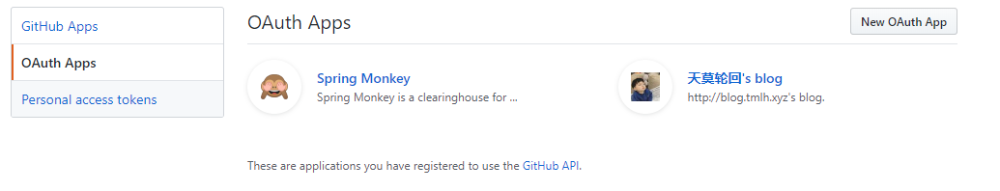
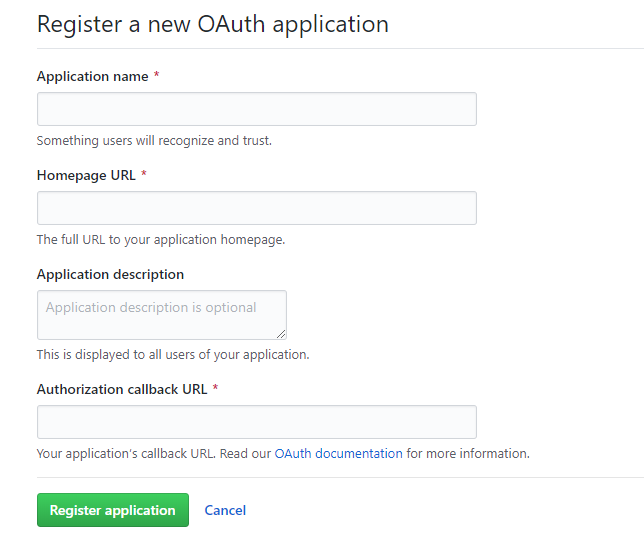
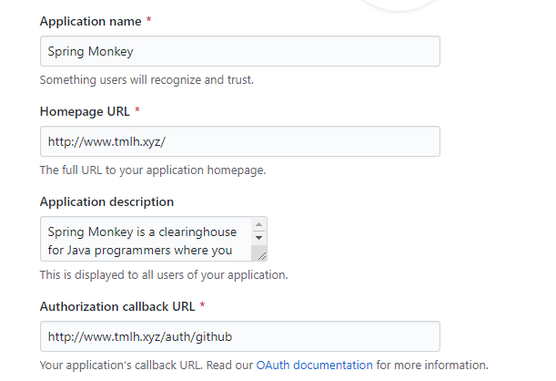

1 作品概述

### 1.1简介

>    [~~Spring Monkey~~](http://www.tmlh.xyz) 是一个是一款基于最新技术开发的多人在线、简洁的博客社区系统。
>
>    ​   springMonkey后台: ~~http://www.tmlh.xyz/admin~~  admin/123456
>
>    ​   主库地址:https://github.com/tmlh98/spring-monkey

### 1.2 项目特点

- [x] 项目使用springboot构建，技术选型新颖
- [x] 详细的代码注释，架构清晰，强扩展性，可配置性

- [x] 支持多平台(qq、github、gitee)社交账号登陆

- [x] spring security 做身份认证

- [x] 丰富的日志记录，轻松监控网站

- [x] 界面简洁，舒适，良好的交互性

      ​

      ​

### 1.3分支说明

- ~~dev-v1    Springboot1.5.x + Thymeleaf~~
- ~~dev-2     Springboot2.0.x + Thymeleaf~~
- master    Springboot2.0.x + Freemarker

## 2 作品用到的相关技术概述

### 2.1 前端

| 框架               | 描述     | 相关资料                                     |
| ---------------- | ------ | ---------------------------------------- |
| bootstarp        | 布局与组件  | <http://www.bootcss.com/>                |
| jquery           | DOM操作  | <https://jquery.com/>                    |
| Font Awesome     | 字体图标   | <http://www.fontawesome.com.cn/>         |
| bootstrap-notify | 通知     | <http://bootstrap-notify.remabledesigns.com/> |
| adminlte         | 后台管理页面 | <https://adminlte.io/themes/AdminLTE/pages/tables/simple.html#> |
| bootstrap-table  | 列表管理   | <https://bootstrap-table.com/>           |
| sweetalert.js    | 弹层     | <https://sweetalert.js.org/guides/>      |
| wangEditor       | 富文本    | <https://www.kancloud.cn/>               |
| ...              |        |                                          |

### 2.2 后端

| 框架              | 描述          | 相关资料                                     |
| :-------------- | ----------- | :--------------------------------------- |
| spring boot     | 构建          | <https://spring.io/projects/spring-boot> |
| spring security | 安全          | <https://spring.io/projects/spring-security> |
| spring social   | 设计          | <https://projects.spring.io/spring-social/> |
| mybatis plus    | mybatis增强工具 | [https://mybatis.plus](https://mybatis.plus/) |
| thymeleaf       | 后端模板引擎      | <https://www.thymeleaf.org/>             |
| swagger2        | REST API文档  | <https://swagger.io/>                    |
| ...             |             |                                          |

## 3 设计过程及技术

### 3.1 工程结构

> spring monkey 采用maven构建，分为四个子工程，每个子工程担任不同的职责。

- tmlh-forum			父工程，管理依赖版本，项目打包发布

- tmlh-forum-scoail 	社交模板，集成QQ、GitHub社交登陆,及对可用配置的管理	
- tmlh-forum-security    安全模块，security的一些配置
- tmlh-forum-core           核心模块，管理data,model,dao,enum...
- tmlh-forum-web            web模块，页面显示用

### 3.2 数据库设计

> 为了以后程序的模块化，这里采用了逻辑外键的方式，考虑的级联删除的问题，只在article 与comment建立外键关系。
>

- tbl_userconnection	存放设计用户唯一标识
- tbl_article                       文章表
- tbl_user                          社交用户表
- tbl_admin                       管理员账户
- tbl_comment                 评论表
- tbl_social                        社交用户关系表，保存粉丝关联
- tbl_catalog                     文章分类表
- sys_log                            记录系统日志
- persistent_logins           登陆的token信息

结构设计遵循以下的原则：

（1）  尽可能的减少数据冗余和重复。

（2）  结构设计与操作设计相结合。

（3）  数据结构具有相对的稳定性。

（4）  遵循数据库设计三范式。

 

## 4 使用说明

### 4.1更改配置文件

1. 将tmlh-forum-web里面的application-dev.yml.example重命名为application.yml
2. 导入sql文件并修改配置文件,数据库相关配置
3. 开发时指定spring.profiles.active=dev环境
4. 修改host文件

   - windows下打开目录C:\Windows\System32\drivers\etc
   - 以管理员的权限打开hosts文件
   - 在最后一行加入 ``127.0.0.1       www.tmlh.xyz``
5. 启动项目并打开浏览器访问  www.tmlh.xyz

### 4.2 关于社交登录

这里以码云登录为例

- [x] 打开 Setting -> Developer setting -> OAuth apps

- [x] 点击 new OAuth App

- [x] 填入相关信息,这里注意callback URL 格式(域名/auth/github) 如下：

### 4.3关于配置application.yml可配置

请参考代码 xyz.tmlh.security.core.properties 下的类

